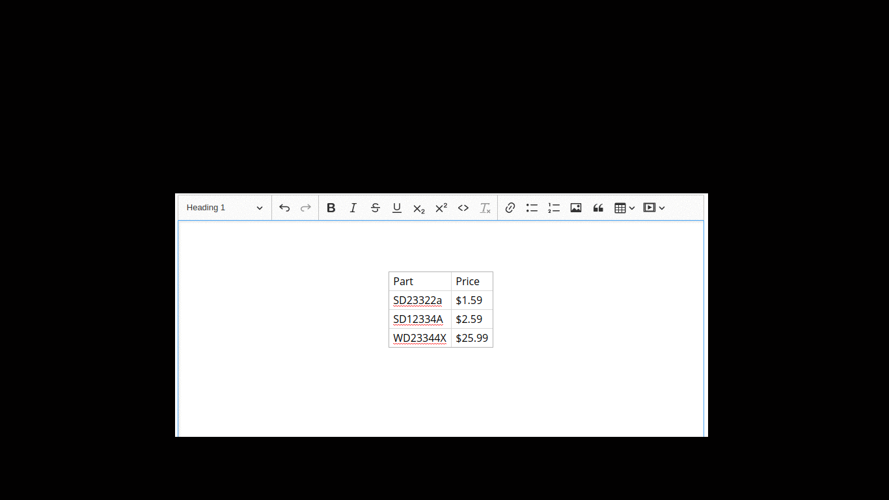

# ckeditor5-table-classes
[](https://badge.fury.io/js/ckeditor5-table-classes)
[](https://david-dm.org/centaur54dev/ckeditor5-table-classes)
[](https://david-dm.org/centaur54dev/ckeditor5-table-classes?type=dev)

## About
This is a plugin for [ckeditor 5](https://github.com/ckeditor/ckeditor5). It allows to assign custom classes to your tables. The classes are added to the Figure element that encapsulates a table:
```
	<Figure class="table foo bar"> 
	   <table> .... </table>
	</Figure>
```
In the above example the 'table' class is assigned automatically by the editor. The next two classes 'foo' and 'bar' are assigned by this plugin.



## Install
Install using NPM: 

`npm install ckeditor5-table-classes`

To add the functionality of this plugin you should make a custom build of the editor. Follow the instructions [here](https://docs.ckeditor.com/ckeditor5/latest/builds/guides/development/installing-plugins.html).


To load the plugin, configure ckeditor (e.g. edit file `ckeditor.js`) like this:

#### Import plugin
```
import import TableClassesPlugin from 'ckeditor5-table-classes/src/tableclasses;
```

#### Import toolbar icons (optional)
```
import Icon1 from 'path-to-icon/iconfile1.svg;
import Icon2 from 'path-to-icon/iconfile2.svg;
```


#### Configure plugin
Assuming that the build is based on Classic Editor:

```
export default class ClassicEditor extends ClassicEditorBase {}

	// Plugins to include in the build.
	ClassicEditor.builtinPlugins = [
		...
		TableClassesPlugin,
		...
	],

	ClassicEditor.defaultConfig = {

		table: {
			/*... other options here ...*/

			tableToolbar: ['tableclass-style1', 'tableclass-style2', ... ]
		},

		TableClasses:{
			items:[
				{id:"style1",   classes:'foo bar', icon:Icon1},
				{id:"style2",   classes:'fancy',   icon:Icon2}
			]
		},


		/* ... other options ... */
	}
};
```
*Note: the toolbar item names should have the format: `tableclass-id`, where `id` should be replaced by the respective id property as defined in TableClasses object.*


## TableClasses options
The predifinded table classes can be customized in the 'TableClasses' object that is passed to the editor, as shown above. Many different classes can be defined that are identified by an id property. The following options are available for each item:
* `id` : (string) a unique id that identifies the item,
* `classes`: (string, space separated) the classes that are going to be assigned to the table if this item is activated,
* `icon`: (optional)(icon object) icon for the respective toolbar button. If missing, a default icon is used,


## Use
Select the entire table by clicking to the top-right handle. The table toolbar appears, from which the predefined items are available. Just click to one or more of them. The assigned classes stack for multiple activated items. You can identify between the items by their tooltip if no icons are loaded. 

To observe any visual effect from the assigned classed you have to configure your css appopriately. 
